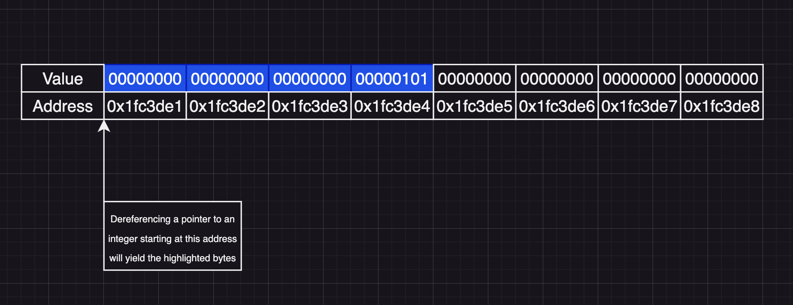
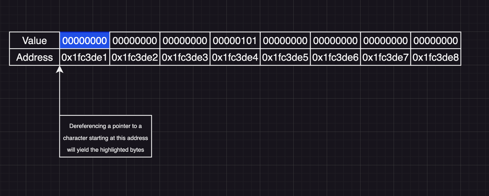

### Pointers

A pointer is the _address_ of something else in memory. Whenever any structure or function or variable is created, it is created _somewhere_ in memory. The value of this _somewhere_ is its address. The size of a pointer is platform dependent. 64-bit architectures have 64-bit (8 byte) pointers. 32-bit architectures have 32-bit (4 byte) pointers. To get the pointer value, use the `&` operator, like so:

##### Example 1.1
```C
#include <stdio.h>

int main() {
    int x = 5; // declare an integer variable
    int *pointer_to_x = &x; // now the variable pointer_to_x contains the address of x in memory
    printf("%p\n", pointer_to_x); // you can print out the address like this if you want to see (%p is the correct format specifier)
    return 0;
}
```

#### Pointer Types

In the above example, we declared a pointer to the integer variable x with the syntax `int *pointer_to_x`. The generalized syntax for this is `<type_name> *<variable_name>`. It should be noted that the alignment of the `*` is personal preference. `<type_name>* <variable_name>` is just as valid. Here's an example of a few pointer types:

##### Example 2.1
```C
int main() {
    char *a; // the variable a is of the type pointer to a character
    short *b; // the variable b is of the type pointer to a short 
    int *c; // the variable c is of the type pointer to an int
    float *d; // the variable d is of the type pointer to a float
    double *e; // the variable e is of the type pointer to a double

    int **f; // the variable f is of the type pointer to an int pointer

    void *g; // the variable g is of the type pointer to void (we will discuss void more later, when we discuss deferencing pointers)
    void **h; // the variable h is of the type pointer to a void pointer (this is insanely useful in the real world)

    return 0;
}
```

So far, we have only seen pointers to primitives, but we can have pointers to anything. For example, here is an example of a pointer to a struct. Don't worry, we will come back to this later if it's confusing.

##### Example 2.2
```C
typedef struct example_struct {
    int x;
    int y;
    int z;
} example_struct;

int main() {
    example_struct *a; // the variable a is of the type pointer to an example struct
    return 0;
}
```

In C++, you can have pointers to classes as well, like so:

##### Example 2.3
```C++

class ExampleClass {
public:
    ExampleClass(){}
private:
    int x_;
    int y_;
    int z_;
};

auto main() -> int {
    ExampleClass *a; // the variable a is of the type pointer to ExampleClass
    return 0;
}
```

#### An Aside About Initialized vs. Uninitialized Memory

In  [Example 1.1](#example-11), the variable `pointer_to_x` is created with the value of `&x`. In [Example 2.1](#example-21), (and also [Example 2.2](#example-22) and [Example 2.3](#example-23)), on the other hand, pointer variables are created but not given a value. We call the variable `pointer_to_x` in [Example 1.1](#example-11) _initialized_ because it has a distinct, known value--the address of the variable `x`. On the other hand, all the variables in [Example 2.1](#example-21) are _uninitialized_ because they are not assigned a value. 

Many programming languages such as Rust do not allow you to (or make it very difficult to) work with uninitialized memory. C and C++, however, have no such qualms. We will discuss uninitialized memory more in the next section. 

#### Dereferencing Pointers

The act of _dereferencing_ a pointer means to _read the value at the address of the pointer_ using the unary `*` operator. This _value_ depends on the type of the pointer. To understand what this means, lets first discuss a simplified version of the memory layout of a program and how data is stored.

You can picture memory (for our purposes) as a boundless array of _cells_. Each cell holds exactly one byte. Each cell is addressable. This means that each cell location corresponds to some memory address. Here's an example. The first 4 bytes store the integer value 5:


Before we move on, I want to highlight that this memory layout is _big endian_. If it were little endian, then then the first 4 bytes would _not_ equal 5. Endianness doesn't matter a whole lot here, but I find big endian slightly easier to read and give examples for.

Also, before diving deep into dereferencing, let's start with an example:

##### Example 3.1
```C
#include <stdio.h>

int main() {
    int x = 5;
    int *pointer_to_x = &x;
    printf("%p\n", pointer_to_x); // print the address where x is stored
    printf("%d\n", *pointer_to_x); // print out the value at the address. this should be 5
    return 0;
}
```
The syntax in line 7 of this program is important. We use the `*` unary operator (as mentioned above) to _dereference_ the pointer variable `pointer_to_x` and get its value. But what does _get it's value_ mean. This value is very dependent on the _pointer type_ that is dereferenced. In this above example, the pointer type is `int *` (pointer to an int). When a pointer to an integer is dereferenced, exactly `sizeof(int)` bytes are read from the location that the pointer represents and interpreted as an integer. When a pointer to a character is dereferenced, exactly `sizeof(char)` byes are read from the location that the pointer represents and interpreted as a character. When a pointer to a structure is dereferenced, exactly `sizeof(<struct_type>)` bytes are read from the location that the pointer represents and interpreted as the structure type. Lets visualize this.

Consider [Example 3.1](#example-31). Assume that the variable `pointer_to_x` (a variable of type `int *`) represents the address `0x1fc3de1`. Dereferencing it means "read exactly sizeof(int)" bytes from that location and interpret them as an integer. In C, at least on my machine, sizeof(int) == 4. So 4 bytes will be read.



What if `pointer_to_x` was a character pointer? There's no rule in C saying we can't use a pointer type which doesn't match. A pointer is just a location, and any type of pointer can point to any location. We could initialize the variable `pointer_to_x` as a character pointer, a long long pointer, or even a void pointer. There's no rule saying we can't, although many IDEs (such as CLion) will warn you if you're doing this. Let's go through a few of these examples and visualize what happens.

##### Example 3.2
```C
#include <stdio.h>

int main() {
    int x = 5;
    char *pointer_to_x = &x; // notice that we're initializing a pointer to x (an integer variable) with an incompatible type (a character pointer)
    printf("%p\n", pointer_to_x); // print the address where x is stored
    printf("%d\n", *pointer_to_x); // print out the value at the address
    return 0;
}
```

Before looking at the visualization below, try to imagine in your head what is happening in line 7. When the pointer is dereferenced, how many bytes are interpreted, and what type are they interpreted as? Hint: you should carefully inspect line 5. 
 d

